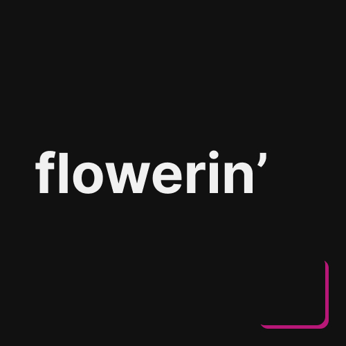

<div align="center">
  
  
  <h3><b>flowerin'</b></h3>
</div>

# 📗 Table of Contents
- [📖 About the Project](#about-project)
  - [⚙️ Production (done)](#production)
    - [Tech Stack](#tech-stack)
    - [Key Features](#key-features)
  - [🚀 Live Demo](#live-demo)
- [💻 Getting Started](#getting-started)
  - [Prerequisites](#prerequisites)
  - [Installation](#installation)
  - [Usage](#usage)
- [🤝 Contributing](#contributing)
- [📝 License](#license)

<br>


# 📖 Flowerin' <a name="about-project"></a>
**Flowerin'** is a minimalistic web application designed to explore and lookouts for various flower. This project was created to experiment using web development tools like Vite, Vue, and TailwindCSS, focusing on delivering a smooth, responsive, and visually appealing user experience.

## ⚙️ Production (done)<a name="production"></a>
This project progressed over the **course of three weeks** before its public release, following several key stages: starts with watching tutorials on YouTube, experimenting with design in Figma, and finally implementing the design into code to complete the project.

### Tech Stack <a name="tech-stack"></a>
- Basic web develompent, such as HTML, CSS, Javascript.
- Vue.js for front-end use.
- Tailwindcss as CSS framework.

### Key Features <a name="key-features"></a>
- **Search Functionality**: Easily find flowers by name, type, or price through the search system.
- **Responsive Design**: Optimized for various screen sizes, ensuring a seamless experience on mobile, tablet, and desktop.
<p align="right">(<a href="#readme-top">back to top</a>)</p>


## 🚀 Live Demo <a name="live-demo"></a>
This project is hosted using **GitHub Pages**, a platform that allows for seamless deployment and hosting of static websites directly from a GitHub repository. You can explore the live version of the website by visiting the following link.
### [Link to website >](https://diazdn-source.online/flowerin/)
<p align="right">(<a href="#readme-top">back to top</a>)</p>


## 💻 Getting Started <a name="getting-started"></a>
To get a local copy up and running, follow these steps.

### Prerequisites
- Clone this project at your directory.
```sh
git clone https://github.com/d1azdn/flowerin
```

### Install
- Install the packages.
```sh
npm install
```

### Usage
- To run the project, execute the following command:
```sh
npm run dev
```
<p align="right">(<a href="#readme-top">back to top</a>)</p>


## 🤝 Contributing <a name="contributing"></a>
Contributions, issues, and feature requests are welcome!
Feel free to check the [issues page](../../issues/).
<p align="right">(<a href="#readme-top">back to top</a>)</p>


## 📝 License <a name="license"></a>
This project is [MIT](./LICENSE) licensed.

_NOTE: we recommend using the [MIT license](https://choosealicense.com/licenses/mit/) - you can set it up quickly by [using templates available on GitHub](https://docs.github.com/en/communities/setting-up-your-project-for-healthy-contributions/adding-a-license-to-a-repository). You can also use [any other license](https://choosealicense.com/licenses/) if you wish._

<p align="right">(<a href="#readme-top">back to top</a>)</p>
